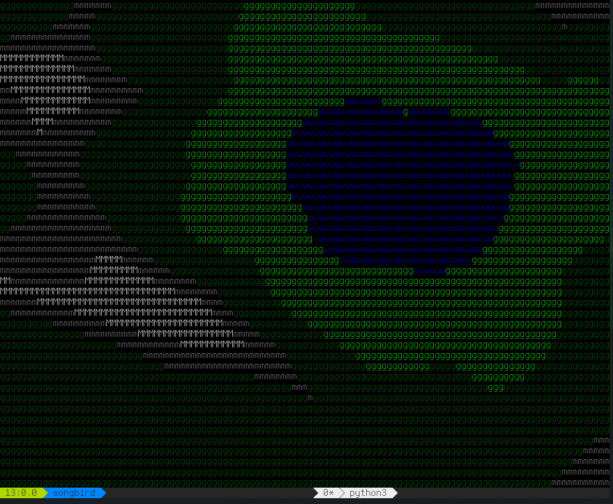
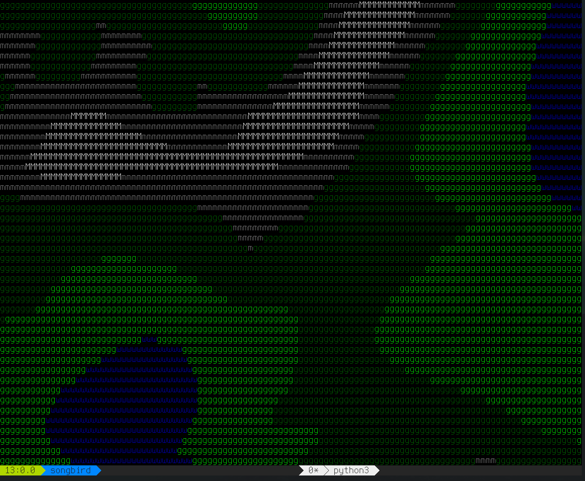
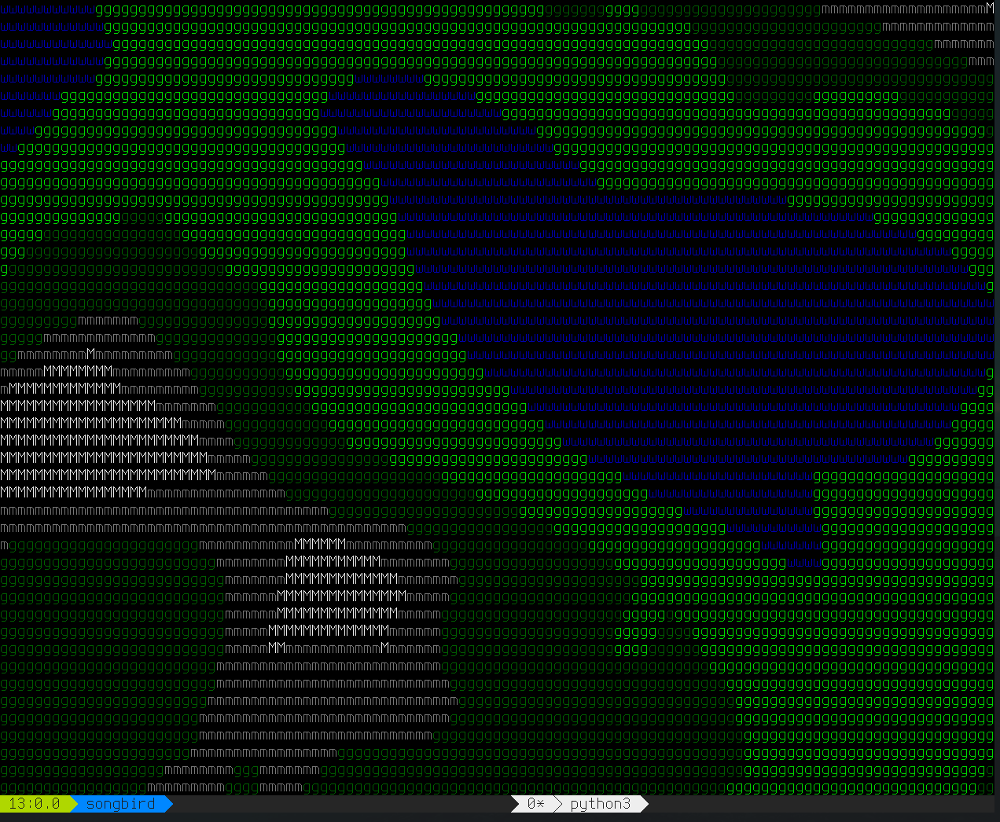

# python-map-generator

A little python script to generate (semi? more on that later)-random worlds/terrains
with ridged Simplex noise. To run:

	cd src && python3 ui.py

and given a few seconds the program will spit out a color landscape map. It uses
256-color through the [asciicinema]() library, and I'm not certain as to how it'll
respond to a non-256-color compliant terminal.

Anyone aiming to modify this for their own use should specifically look towards the
`set_char_EXAMPLE` function within `tmap.py`; that's where shots are called regarding
landscaping types. Additionally, this program seems to struggle in terms of true
variance; there tends to be a ridge (or two) running through the approximate center of
the map. This is consistent through each map I've tested.

## examples

